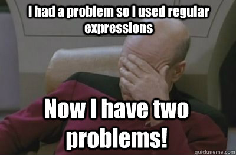

# Regular Expression

A regular expression, commonly called a &ldquo;regexp&rdquo;, is a sequence of characters that define a search pattern. &nbsp;It&nbsp;is&nbsp;mainly for use in pattern matching with strings, or string matching (i.e. it operates&nbsp;like&nbsp;a&nbsp;&ldquo;find and replace&rdquo; command). While it is a very powerful tool, it is also very dangerous because of its complexity.

<strong><em><a href="http://regex.info/blog/2006-09-15/247" title="Some people, when confronted with a problem, think" target="_blank">Some people, when confronted with a problem, think</a></em>
<em><a href="http://regex.info/blog/2006-09-15/247" title="“I know, I&#39;ll use regular expressions.” &nbsp; Now they have two problems." target="_blank">“I know, I&rsquo;ll use regular expressions.” &nbsp; Now they have two problems.</a></em></strong> (super classic joke in the industry)

One thing you have to be careful with is that different languages use different regexp engines. That&nbsp;means&nbsp;that&nbsp;a regexp in Python, for&nbsp;example,&nbsp;will be interpreted differently&nbsp;in Javascript:

Regular expressions are everywhere and software engineers, no&nbsp;matter their positions, will have to use them during their careers. System administrators and DevOps are the ones using them the most because&nbsp;they are very handy for log parsing.

Read about regexp:

<ul>
<li><a href="https://www.regular-expressions.info/" title="http://www.regular-expressions.info/" target="_blank">http://www.regular-expressions.info/</a></li>
<li>
<a href="https://www.w3schools.com/jsref/jsref_obj_regexp.asp" title="http://www.w3schools.com/jsref/jsref_obj_regexp.asp" target="_blank">http://www.w3schools.com/jsref/jsref_obj_regexp.asp</a>
Play with regexp (or compose them):
</li>
<li>
Ruby: <a href="https://rubular.com/" title="http://rubular.com/" target="_blank">http://rubular.com/</a>
</li>
<li>
PHP/Javascript/Python: <a href="https://regex101.com/" title="https://regex101.com/" target="_blank">https://regex101.com/</a>
</li>
</ul>

</article>