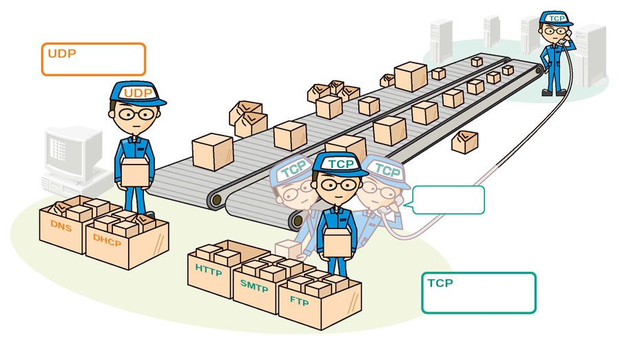

# 0x07-networking_basics

<h2>Resources</h2>

<strong>Read or watch</strong>:

<ul>
<li><a href="https://en.wikipedia.org/wiki/OSI_model" title="OSI model" target="_blank">OSI model</a> </li>
<li><a href="https://www.lifewire.com/lans-wans-and-other-area-networks-817376" title="Different types of network" target="_blank">Different types of network</a> </li>
<li><a href="https://en.wikipedia.org/wiki/Local_area_network" title="LAN network" target="_blank">LAN network</a> </li>
<li><a href="https://en.wikipedia.org/wiki/Wide_area_network" title="WAN network" target="_blank">WAN network</a> </li>
<li><a href="https://en.wikipedia.org/wiki/Internet" title="Internet" target="_blank">Internet</a> </li>
<li><a href="https://whatismyipaddress.com/mac-address" title="MAC address" target="_blank">MAC address</a> </li>
<li><a href="https://www.bleepingcomputer.com/tutorials/ip-addresses-explained/" title="What is an IP address" target="_blank">What is an IP address</a> </li>
<li><a href="https://www.iplocation.net/public-vs-private-ip-address" title="Private and public address" target="_blank">Private and public address</a> </li>
<li><a href="https://www.webopedia.com/insights/ipv6-ipv4-difference/" title="IPv4 and IPv6" target="_blank">IPv4 and IPv6</a> </li>
<li><a href="https://en.wikipedia.org/wiki/Localhost" title="Localhost" target="_blank">Localhost</a> </li>
<li><a href="https://www.howtogeek.com/190014/htg-explains-what-is-the-difference-between-tcp-and-udp/" title="TCP and UDP" target="_blank">TCP and UDP</a> </li>
<li><a href="https://en.wikipedia.org/wiki/List_of_TCP_and_UDP_port_numbers" title="TCP/UDP ports List" target="_blank">TCP/UDP ports List</a> </li>
<li><a href="https://en.wikipedia.org/wiki/Ping_%28networking_utility%29" title="What is ping /ICMP" target="_blank">What is ping /ICMP</a> </li>
<li><a href="https://wiki.bash-hackers.org/scripting/posparams" title="Positional parameters" target="_blank">Positional parameters</a> </li>
</ul>

<strong>man or help</strong>:

<ul>
<li><code>netstat</code></li>
<li><code>ping</code></li>
</ul>

<h2>Learning Objectives</h2>

<h3>OSI Model</h3>

<ul>
<li>What it is</li>
<li>How many layers it has</li>
<li>How it is organized</li>
</ul>

<h3>What is a LAN</h3>

<ul>
<li>Typical usage</li>
<li>Typical geographical size</li>
</ul>

<h3>What is a WAN</h3>

<ul>
<li>Typical usage</li>
<li>Typical geographical size</li>
</ul>

<h3>What is the Internet</h3>

<ul>
<li>What is an IP address</li>
<li>What are the 2 types of IP address</li>
<li>What is <code>localhost</code></li>
<li>What is a subnet</li>
<li>Why IPv6 was created</li>
</ul>

<h3>TCP/UDP</h3>

<ul>
<li>What are the 2 mainly used data transfer protocols for IP (transfer level on the OSI schema)</li>
<li>What is the main difference between TCP and UDP</li>
<li>What is a port</li>
<li>Memorize SSH, HTTP and HTTPS port numbers</li>
<li>What tool/protocol is often used to check if a device is connected to a network</li>
</ul>

<h2>More Info</h2>

The second line of all your Bash scripts should be a comment explaining what is the script doing

For multiple choice question type tasks, just type the number of the correct answer in your answer file, add a new line for every new answer, example:

What is the most important position in a software company?

<ol>
<li>Project manager</li>
<li>Backend developer</li>
<li>System administrator</li>
</ol>

<pre><code>sylvain@ubuntu$ cat foo_answer_file
3
sylvain@ubuntu$
</code></pre>

Source for question 1 <a href="https://twitter.com/devopsreact/status/831922429215662080" title="here" target="_blank">here</a>

  

---

## TASKS

<h3 class="panel-title">
      0. OSI model
    </h3>

OSI (Open Systems Interconnection) is an abstract model to describe layered communication and computer network design. The idea is to segregate the different parts of what make communication possible.

It is organized from the lowest level to the highest level:

<ul>
<li>The lowest level: layer 1 which is for transmission on physical layers with electrical impulse, light or radio signal</li>
<li>The highest level: layer 7 which is for application specific communication like SNMP for emails, HTTP for your web browser, etc</li>
</ul>

Keep in mind that the OSI model is a concept, it&rsquo;s not even tangible. The OSI model doesn&rsquo;t perform any functions in the networking process.
It is a conceptual framework so we can better understand complex interactions that are happening.
Most of the functionality in the OSI model exists in all communications systems.

In this project we will mainly focus on:

<ul>
<li>The Transport layer and especially TCP/UDP</li>
<li>On the Network layer with IP and ICMP</li>
</ul>

The image bellow describes more concretely how you can relate to every level.

Questions:

What is the OSI model?

<ol>
<li>Set of specifications that network hardware manufacturers must respect</li>
<li>The OSI model is a conceptual model that characterizes the communication functions of a telecommunication system without regard to their underlying internal structure and technology</li>
<li>The OSI model is a model that characterizes the communication functions of a telecommunication system with a strong regard for their underlying internal structure and technology</li>
</ol>

How is the OSI model organized?

<ol>
<li> Alphabetically</li>
<li>From the lowest to the highest level</li>
<li>Randomly</li>
</ol>

  

[Answer](./0-OSI_model)

---

 <h3 class="panel-title">
      1. Types of network
    </h3>

LAN connect local devices together, WAN connects LANs together, and WANs are operating over the Internet.

Questions:

What type of network a computer in local is connected to?

<ol>
<li>Internet</li>
<li>WAN</li>
<li>LAN</li>
</ol>

What type of network could connect an office in one building to another office in a building a few streets away?

<ol>
<li>Internet</li>
<li>WAN</li>
<li>LAN</li>
</ol>

What network do you use when you browse www.google.com from your smartphone (not connected to the Wifi)?

<ol>
<li>Internet</li>
<li>WAN</li>
<li>LAN</li>
</ol>

  

[Answer](./1-types_of_network)

---

<h3 class="panel-title">
      2. MAC and IP address
    </h3>

   

Questions:

What is a MAC address?

<ol>
<li>The name of a network interface</li>
<li>The unique identifier of a network interface</li>
<li>A network interface</li>
</ol>

What is an IP address?

<ol>
<li>Is to devices connected to a network what postal address is to houses</li>
<li>The unique identifier of a network interface</li>
<li>Is a number that network devices use to connect to networks</li>
</ol>

  

[Answer](./2-MAC_and_IP_address)

---

<h3 class="panel-title">
      3. UDP and TCP
    </h3>

Let&rsquo;s fill the empty parts in the drawing above.

Questions:

<ul>
<li>Which statement is correct for the TCP box:

<ol>
<li><code>It is a protocol that is transferring data in a slow way but surely</code></li>
<li><code>It is a protocol that is transferring data in a fast way and might loss data along in the process</code></li>
</ol></li>
<li>Which statement is correct for the UDP box:

<ol>
<li><code>It is a protocol that is transferring data in a slow way but surely</code></li>
<li><code>It is a protocol that is transferring data in a fast way and might loss data along in the process</code></li>
</ol></li>
<li>Which statement is correct for the TCP worker:

<ol>
<li><code>Have you received boxes x, y, z?</code></li>
<li><code>May I increase the rate at which I am sending you boxes?</code></li>
</ol></li>
</ul>

  

[Answer](./3-UDP_and_TCP)

---

<h3 class="panel-title">
      4. TCP and UDP ports
    </h3>

   

Once packets have been sent to the right network device using IP using either UDP or TCP as a mode of transportation, it needs to actually enter the network device.

If we continue the comparison of a network device to your house, where IP address is like your postal address, UDP and TCP ports are like the windows and doors of your place. A TCP/UDP network device has 65535 ports. Some of them are officially reserved for a specific usage, some of them are known to be used for a specific usage (but nothing is officially declared) and the rest are free of use.

While the full list of ports should not be memorized, it is important to know the most used ports, let&rsquo;s start by remembering 3 of them:

<ul>
<li><strong>22</strong> for SSH</li>
<li><strong>80</strong> for HTTP</li>
<li><strong>443</strong> for HTTPS</li>
</ul>

Note that a specific <a href="https://stackoverflow.com/questions/152457/what-is-the-difference-between-a-port-and-a-socket" title="IP + port = socket" target="_blank">IP + port = socket</a>.

Write a Bash script that displays listening ports:

<ul>
<li>That only shows listening sockets</li>
<li>That shows the PID and name of the program to which each socket belongs</li>
</ul>

Example:

<pre><code>sylvain@ubuntu$ sudo ./4-TCP_and_UDP_ports
Active Internet connections (only servers)
Proto Recv-Q Send-Q Local Address           Foreign Address         State       PID/Program name
tcp        0      0 *:sunrpc                *:*                     LISTEN      518/rpcbind
tcp        0      0 *:ssh                   *:*                     LISTEN      1240/sshd
tcp        0      0 *:32938                 *:*                     LISTEN      547/rpc.statd
tcp6       0      0 [::]:sunrpc             [::]:*                  LISTEN      518/rpcbind
tcp6       0      0 [::]:ssh                [::]:*                  LISTEN      1240/sshd
tcp6       0      0 [::]:33737              [::]:*                  LISTEN      547/rpc.statd
udp        0      0 *:sunrpc                *:*                                 518/rpcbind
udp        0      0 *:691                   *:*                                 518/rpcbind
udp        0      0 localhost:723           *:*                                 547/rpc.statd
udp        0      0 *:60129                 *:*                                 547/rpc.statd
udp        0      0 *:3845                  *:*                                 562/dhclient
udp        0      0 *:bootpc                *:*                                 562/dhclient
udp6       0      0 [::]:47444              [::]:*                              547/rpc.statd
udp6       0      0 [::]:sunrpc             [::]:*                              518/rpcbind
udp6       0      0 [::]:50038              [::]:*                              562/dhclient
udp6       0      0 [::]:691                [::]:*                              518/rpcbind
Active UNIX domain sockets (only servers)
Proto RefCnt Flags       Type       State         I-Node   PID/Program name    Path
unix  2      [ ACC ]     STREAM     LISTENING     7724     518/rpcbind         /run/rpcbind.sock
unix  2      [ ACC ]     STREAM     LISTENING     6525     1/init              @/com/ubuntu/upstart
unix  2      [ ACC ]     STREAM     LISTENING     8559     835/dbus-daemon     /var/run/dbus/system_bus_socket
unix  2      [ ACC ]     STREAM     LISTENING     9190     1087/acpid          /var/run/acpid.socket
unix  2      [ ACC ]     SEQPACKET  LISTENING     7156     378/systemd-udevd   /run/udev/control
sylvain@ubuntu$
</code></pre>

  

[Answer](./4-TCP_and_UDP_ports)

---

<h3 class="panel-title">
      5. Is the host on the network
    </h3>

   

The Internet Control Message Protocol (ICMP) is a protocol in the Internet protocol suite. It is used by network devices, to check if other network devices are available on the network. The command <code>ping</code> uses ICMP to make sure that a network device remains online or to troubleshoot issues on the network. 

Write a Bash script that pings an IP address passed as an argument.

Requirements: 

<ul>
<li>Accepts a string as an argument</li>
<li>Displays <code>Usage: 5-is_the_host_on_the_network {IP_ADDRESS}</code> if no argument passed</li>
<li>Ping the IP 5 times</li>
</ul>

Example:

<pre><code>sylvain@ubuntu$ ./5-is_the_host_on_the_network 8.8.8.8
PING 8.8.8.8 (8.8.8.8) 56(84) bytes of data.
64 bytes from 8.8.8.8: icmp_seq=1 ttl=63 time=12.9 ms
64 bytes from 8.8.8.8: icmp_seq=2 ttl=63 time=13.6 ms
64 bytes from 8.8.8.8: icmp_seq=3 ttl=63 time=7.83 ms
64 bytes from 8.8.8.8: icmp_seq=4 ttl=63 time=11.3 ms
64 bytes from 8.8.8.8: icmp_seq=5 ttl=63 time=7.57 ms

--- 8.8.8.8 ping statistics ---
5 packets transmitted, 5 received, 0% packet loss, time 4006ms
rtt min/avg/max/mdev = 7.570/10.682/13.679/2.546 ms
sylvain@ubuntu$
sylvain@ubuntu$ ./5-is_the_host_on_the_network
Usage: 5-is_the_host_on_the_network {IP_ADDRESS}
sylvain@ubuntu$ 
</code></pre>

It is interesting to look at the <code>time</code> value, which is the time that it took for the ICMP request to go to the <code>8.8.8.8</code> IP and come back to my host. The IP <code>8.8.8.8</code> is owned by Google, and the quickest roundtrip between my computer and Google was 7.57 ms which is pretty fast, which is a sign that the network path between my computer and Google&rsquo;s datacenter is in good shape. A slow ping would indicate a slow network.

Next time you feel that your connection is slow, try the <code>ping</code> command to see what is going on!

  

[Answer](./5-is_the_host_on_the_network)

---